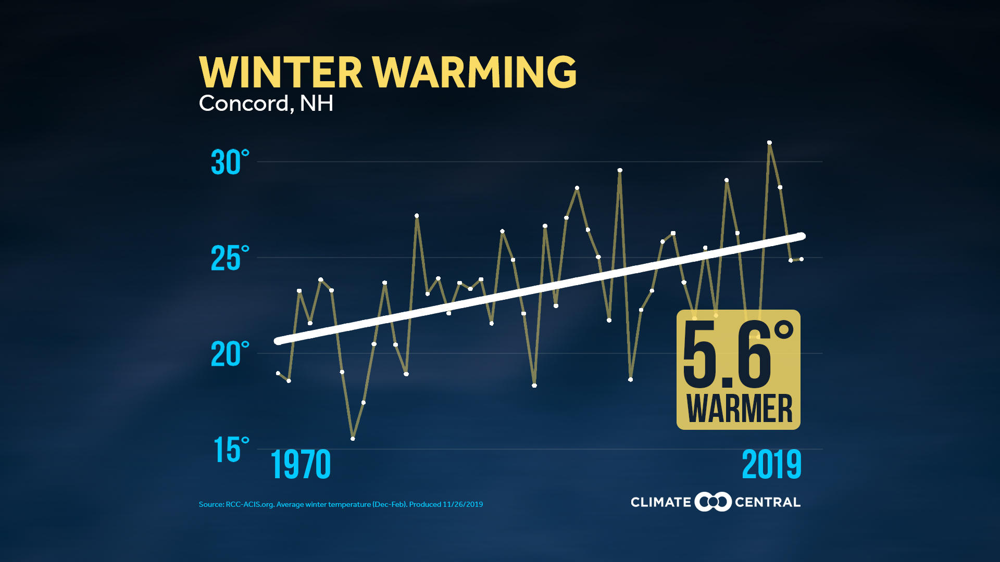

```{r setup, include=FALSE}
knitr::opts_chunk$set(echo = TRUE)
require(tidyverse)
require(ggplot2)
require(ggimage)
require(ggthemes)
require(Hmisc)
require(pipeR)
```

#### New Hampshire Winters Are Among The Fastest-Warming In The Country

This was the startling headling in an [NHPR](https://www.nhpr.org) [article](https://www.nhpr.org/post/new-hampshire-winters-are-among-fastest-warming-country) published in December 2019. The accompanying chart showed a linear trend of an alarming 5.6 degree Fahrenheit increase in average winter (Dec-Feb) temperature from 1970 to 2019 in [Concord](https://www.ncdc.noaa.gov/cdo-web/datasets/GHCND/stations/GHCND:USW00014745/detail)

  

### The Challenge  

The winter from both December 2017 and 2018 both had sequential AO lows with incredibly weak polar vortex that repeatedly allowed arctic air to dip into New Hampshire. The northern area of our state dropped well under twenty below overnight, [colder than Mars](https://www.cnn.com/2018/01/03/us/cold-weather-arctic-outbreak/index.html) and often barely broke into single digits during the day. And in February 2017 even [NHPR reported on the cold](https://www.nhpr.org/post/polar-vortex-back#stream/0) How could there be such a high trend? Perhaps the seventies did have much colder winters? So I decided to look at the data myself.  

### The Data Source
After some searching, including going to [Climate Central's website](https://www.climatecentral.org) I managed to match the data in the original graph from [NOAA Climate at a Glance](https://www.ncdc.noaa.gov/cag) on their [Concord page](https://www.ncdc.noaa.gov/cag/city/time-series/USW00014745/tavg/3/2/1970-2019?base_prd=true&begbaseyear=1901&endbaseyear=2000)

From there, I [downloaded the data](https://www.ncdc.noaa.gov/cag/city/time-series/USW00014745-tavg-3-2-1970-2019.csv?base_prd=true&begbaseyear=1940&endbaseyear=2000) and processed it to a tibble.

```{r concord-winter-averages}
concord<-readRDS("concord.rds")
describe(concord$Value)

```

### Analysis  

The data seemed very well behaved, although five averages seemed to be missing, for years 1973-1975 and 1979-1980. More on that later.  

Similarly plotted with regression and line connectors:


```{r Temp-Year-OLS}
winterFit<-function(df,y,x){
 fitvals<-df %>%
   select(ly=!!enquo(y),lx=!!enquo(x)) %>%
   lm(ly ~lx , data=.) %>%
   fitted.values() 
 fitstats <-  df %>%
    select(ly=!!enquo(y),lx=!!enquo(x)) %>%
    lm(ly ~lx , data=.) %>%
   summary() %>>%
   (r.squared)
 return(list(fitvals,fitstats))
}
f<-winterFit(concord,Value,Year)
fittedvals=f[1][[1]]
rsquared=f[2][[1]]
predictOne=fittedvals[1]
PredictTwo=fittedvals[2]
predictLast=fittedvals[length(fittedvals)]
annualTrend=PredictTwo-predictOne
```

```{r concord-chart}
winterPlot<-function(df,y,x){
ggplot({{df}}, aes({{x}}, {{y}})) +
  geom_point() +
  geom_line() +
  geom_smooth(method = "lm", se=FALSE) + 
  scale_y_continuous("Average Temperature °F", c(15,20,25,30,35)) +
  theme_economist_white() 

  }
winterPlot(concord,Value,Year)
```

This data has a 2002 at 30.7°F where the published chart shows that point under 30°, and the five missing years are troublesome. Time to perform a full linear regression.


The annual OLS trend is  `r annualTrend` and a final change of `r predictLast-predictOne` ... much lower than the published predicted increase.  

The only way to be sure is to pull the daily station values from the NOAA API

```{r daily-values}
fullconcord=readRDS("fullconcord.rds")
concord_summary=readRDS("concord_summary.rds")
```
```{r updated-stats}
decades<-concord_summary %>% 
  filter(wyear>=1970) %>% 
  filter(wyear<2019) %>%
  winterPlot(avgtemp,wyear)

```


Which approximates the published chart:


```{r alternate-plots}
decades<-concord_summary %>% 
  filter(wyear>=1950) %>% 
  filter(wyear<2019) #%>%
winterPlot(decades,avgtemp,wyear)
decades<-concord_summary %>% 
  filter(wyear>=1940) %>% 
  filter(wyear<2019) #%>%
winterPlot(decades,avgtemp,wyear)
decades<-concord_summary %>% 
  filter(wyear>=2000) %>% 
  filter(wyear<2019) #%>%
winterPlot(decades,avgtemp,wyear)

```
